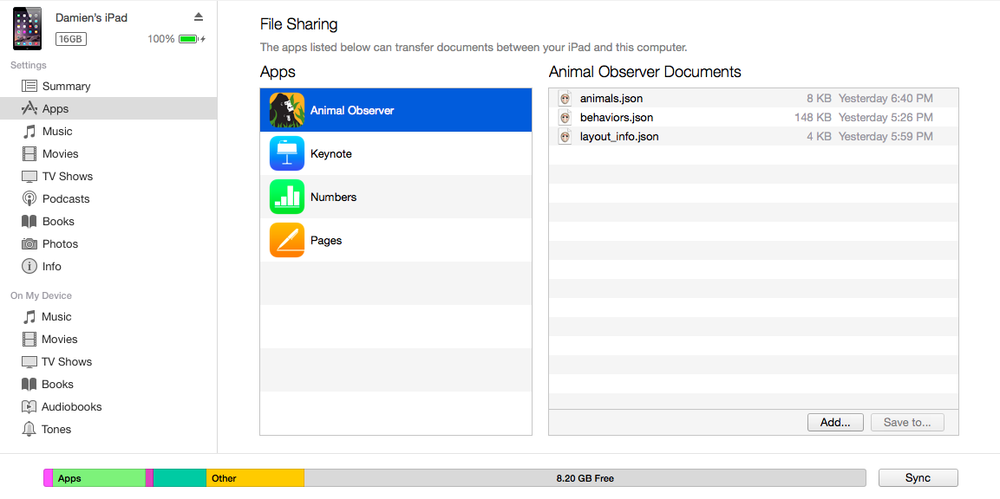

### What is the Animal Observer Toolbox?

IMPORTANT: if you are reading this text in RStudio's default html window, click on "Open in Browser" at the top of the window before you go any further. AO ToolBox works better in a regular web browser such as Chrome or Firefox.

AO Toolbox is a user-friendly web application that allows you to fully customize the Animal Observer iPad application. AO Toolbox executes R functions in the background. The open source code is accessible on [github](https://github.com/FosseyFund/AOToolBox).

To customize Animal Observer You will have to prepare three files ---in ".json" format--- including the protocol you wish to implement for your data collection. You do not need any prior R knowledge to use AO toolbox.

Use the tabs above for instructions on how to create the three protocol files:

* <a id="link_to_structure" href="#" class="action-button">behaviors.json</a>
* <a id="link_to_studyanimals" href="#" class="action-button">animals.json</a>
* <a id="link_to_globalvar" href="#" class="action-button">layout_info.json</a> 

Once you have created these files, add them to the Animal Observer application. You will need to connect your iPad with Animal Observer installed to your computer and open the [iTunes software](http://www.apple.com/itunes/download/). Follow these steps:

1. In iTunes, click on the iPad icon 
2. Click on the **Apps** tab. Scroll down to **File Sharing** and click on the Animal Observer app.
3. Drag and drop the three ".json" protocol files to the **Animal Observer Documents** panel. 
4. If Animal Observer is already open on your device, log out and restart.

*N.B.* For additional customization of the application, follow <a id="link_to_customization" href="#" class="action-button">these instructions</a>. These extra files should also be added to the **Animal Observer Documents** panel. 

***

***

<strong>
If you have any questions about the toolbox or the app, please email <a href="mailto:animal.observer@gorillafund.org" target="_top">Damien Caillaud</a>.
</strong>

***

